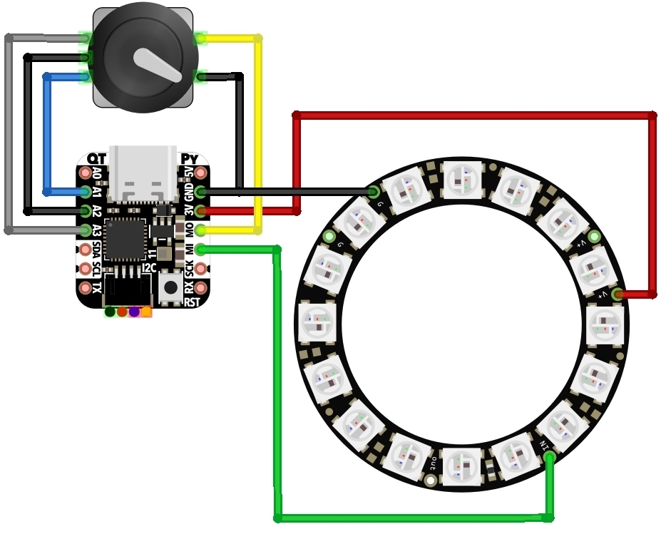

# QTPy-Knob

QT Py USB Media Knob using rotary encoder &amp; neopixel ring

The QTPy-Knob features:
- Media knob for volume up/down/mute with "qtpy-knob.py" CircuitPython program
- Stylish design reminiscent of Griffin Powermate
- Recessed USB-C connector to for safety
- No screws needed for assembly
- Only 3 wires needed to solder (none if you want to forgo LED lighting)
- Reprogrammable for any USB macro key action via CircuitPython

This is an attempt to make a minimal and easy-to-build version of similar, previous projects like:
- https://learn.adafruit.com/trinket-usb-volume-knob
- https://learn.adafruit.com/media-dial

## Components

Parts needed:

- Adafruit QT Py (https://www.adafruit.com/product/4600)
- Adafruti Neopixel Ring (https://www.adafruit.com/product/1463 or equiv)
- Rotary encoder (https://www.adafruit.com/product/377 or equiv)
- 3D printed enclosure (see "cad" folder)

## Software

[tbd]

## Assembly

[tbd, but basically...]

