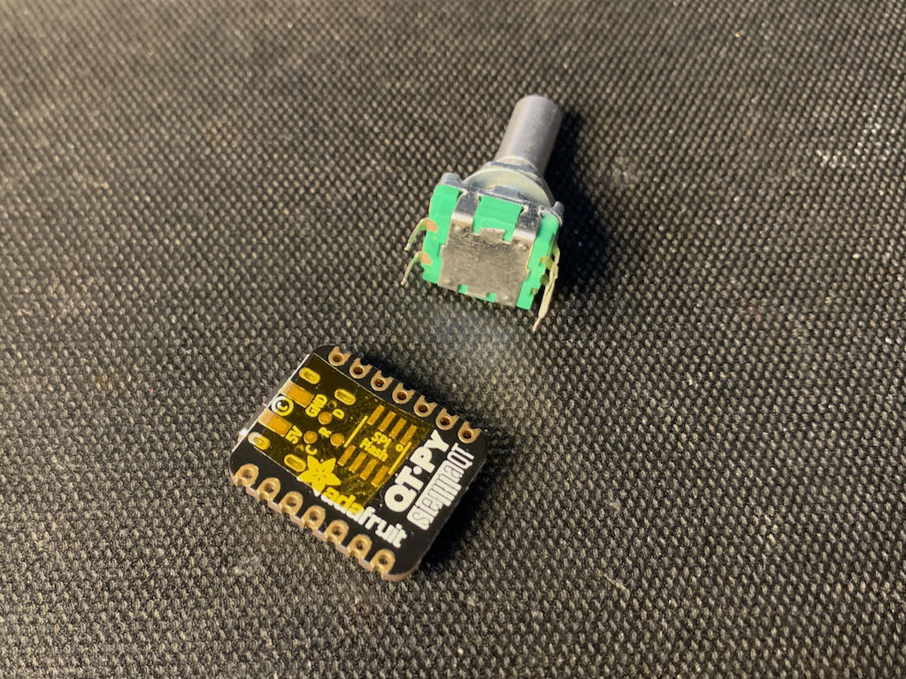
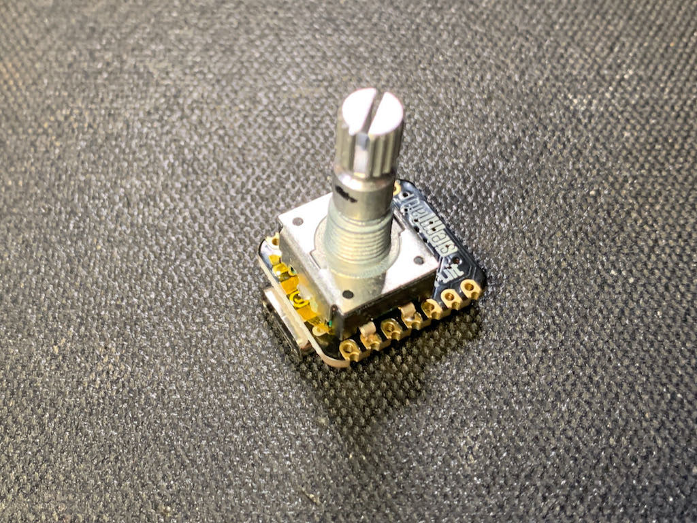
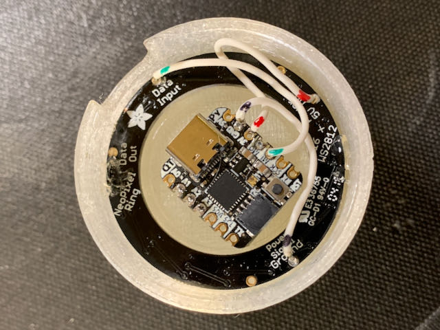

# QTPy-Knob

QT Py USB Media Knob using rotary encoder &amp; neopixel ring


The QTPy-Knob features:
- Media knob for volume up/down/mute with "qtpy-knob.py" CircuitPython program
- Stylish design reminiscent of Griffin Powermate
- Recessed USB-C connector to for safety
- No screws needed for assembly
- Only 3 wires needed to solder (none if you want to forgo LED lighting)
- Reprogrammable for any USB macro key action via CircuitPython

A small video about it: https://www.youtube.com/watch?v=pt7JgoSlgOg

This is an attempt to make a minimal and easy-to-build version of similar, previous projects like:
- https://learn.adafruit.com/trinket-usb-volume-knob
- https://learn.adafruit.com/media-dial

## Components

Parts needed:

- Adafruit QT Py (Originally for [QTPy M0](https://www.adafruit.com/product/4600) or [XIAO SAMD21](https://www.seeedstudio.com/Seeeduino-XIAO-Arduino-Microcontroller-SAMD21-Cortex-M0+-p-4426.html), but [QTPy RP2040](https://www.adafruit.com/product/4900) does work via a `fakerotaryio` hack)
- Adafruit Neopixel Ring (https://www.adafruit.com/product/1463 or equiv)
- Rotary encoder (PEC11-4120F-S0018 or equiv. The 3D printed case expects encoder w/ 20mm shaft & 7mm threaded barrel, see [here for mods if using a 15mm encoder](https://github.com/todbot/qtpy-knob/issues/2))
- 3D printed enclosure (see "cad" folder)

## Software

For some of the scripts and for some QT Py variants,
there are [prebuilt UF2 firmware images in Releases](https://github.com/todbot/qtpy-knob/releases).

Otherwise, software installation consists of:
- Install CircuitPython on the QT Py
- Install required CircuitPython libraries to QT Py
- Copy qtpy_knob.py to QT Py

The CircuitPython installation step is described here: https://learn.adafruit.com/welcome-to-circuitpython/installing-circuitpython

The last two steps can be accomplished with the below

```
git clone https://github.com/todbot/qtpy-knob
cd qtpy-knob
pip3 install circup
circup install -r requirements.txt
cp qtpy_knob.py /Volumes/CIRCUITPY/code.py
```

**RP2040 NOTE:** And if you have a QTPy RP2040, be sure to copy the "fakerotaryio.py" file to CIRCUITPY as well.

### Variations

There are a few variations of the code provided:
- [`qtpy_knob.py`](./qtpy_knob.py)  -- volume up / down and mute
- [`qtpy_knob_scroller.py`](./qtpy_knob_scroller.py) -- performs vertical & horizontal scrolling
- [`qtpy_knob_midi_cc.py`](./qtpy_knob_midi_cc.py) -- sends MIDI CC instead of keyboard/mouse
- [`qtpy_knob_simple.py`](./qtpy_knob_simple.py) -- no neopixel stuff, just encoder and USB vol up/down sending

## Assembly

Steps:

1. Plug rotary encoder to bottom of QT Py. If your encoder has metal on the bottom,
add a bit of tape (Kapton, Scotch, electrical) in between the QT Py and the encoder.  If your encoder has mounting tabs, cut them off.  Solder the five pins.

  


2. Print out the enclosure on your 3d printer. Standard 0.2mm at 20% infill is fine.  The STL files are:

- `qtpyknob-base.stl` -- Base that houses the QT Py & rotary encoder
- `qtpyknob-basecap.stl` -- Cap that goes on the bottom of the base
- `qtpyknob-knob.stl` -- Knob that you turn
- `qtpyknob-diffuser.stl` -- Light diffuser that goes between base & knob, should be printed with translucent or clear plastic. Or you can leave it out. Or you can approxiate it with a disk cut out clear plastic like a CD case

Use the rotary encoder's washer & screw to hold QTPy+encoder assembly

  


3. Solder three wires to the Neopixel ring, insert the ring into the enclosure and solder the wires to the 3V, Gnd, and MI pins of the QT Py.  Use a bit of hot glue to secure the Neopixel ring if it doesn't snap in.

  

4. Snap the bottom cap on and the knob top on and you're done with physical assembly!

  


### Wiring diagram


### Assembly animation


## Useful links

Resources that helped me out on this:

- https://learn.adafruit.com/media-dial
- https://learn.adafruit.com/make-it-a-keyboard/circuitpython
- https://github.com/adafruit/Adafruit_CircuitPython_HID/tree/master/examples
- https://circuitpython.readthedocs.io/projects/hid/en/latest/api.html#adafruit-hid-consumer-control-consumercontrol
- https://learn.adafruit.com/trinket-usb-volume-knob
